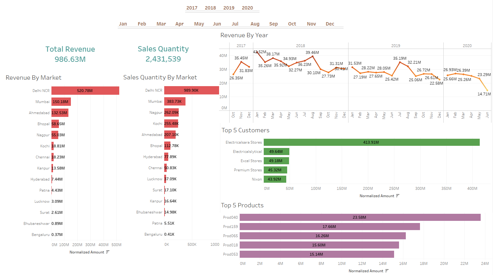

# AtliQ Hardware Sales Analysis

## Project Overview
AtliQ Hardware Sales Analysis is a data-driven project designed to deliver quick, automated, and insightful sales reporting. The dashboard empowers stakeholders to make faster and smarter decisions, ultimately reducing manual reporting efforts and increasing efficiency.

---

## Purpose
- Unlock hidden sales insights to support decision-making.
- Automate reporting to minimize manual data gathering time.

---

## Stakeholders
- Sales Director  
- Marketing Team  
- Customer Service Team  
- Data & Analytics Team  
- IT Team  

---

## Key Objectives
1. **Automated Dashboard**: Real-time insights for quick decision-making.
2. **Efficiency Gains**: Save 20% of analysts' time on manual data tasks.
3. **Cost Savings**: Enable 10% reduction in total spending through better decisions.

---

## Success Criteria
- Interactive dashboards with actionable sales insights.  
- Improved decision-making for the sales team.  
- Enhanced efficiency in business operations.

---

## Technologies Used
- **MySQL**: Data storage and processing.  
- **Tableau**: Visualization and dashboard creation.  

---

## Key Insights
1. **Revenue Trends**: Identifies yearly and market-specific revenue performance.  
2. **Top Customers and Products**: Highlights key contributors to sales.  
3. **Sales Quantity Analysis**: Compares sales performance across regions.  
4. **Cost and Time Savings**: Automates manual reporting processes.

---

## The Result
An automated Tableau dashboard that offers actionable insights for sales teams and supports data-driven decision-making.

---

## How to Run This Project
1. Connect the provided MySQL dataset to Tableau.
2. Open the Tableau workbook and refresh the data source.
3. Explore the dashboards for insights.

---

## Screenshots

---

## Author
**Ilyas Atmani**  
For any queries, please contact: `atmanuilyas@gmail.com`
